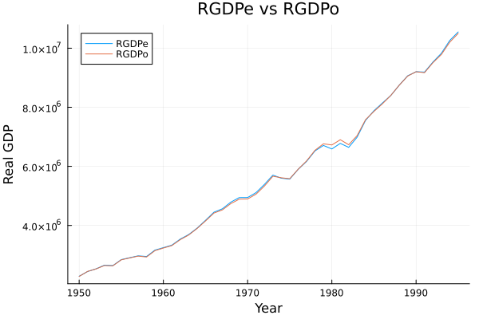
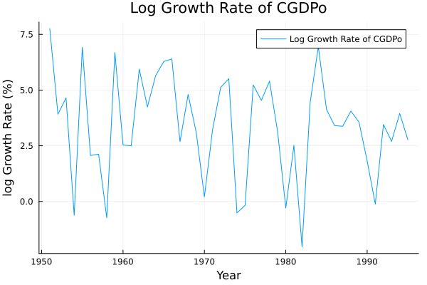
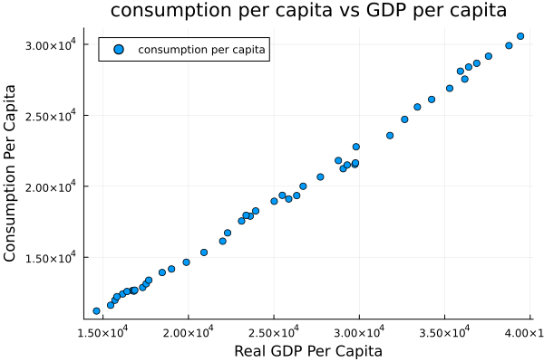
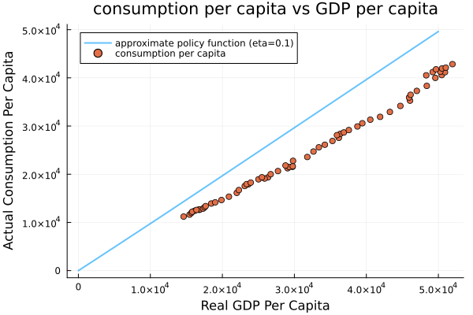
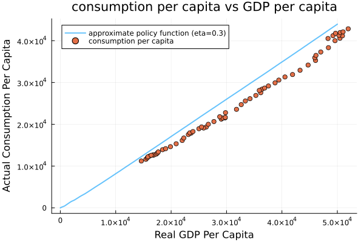
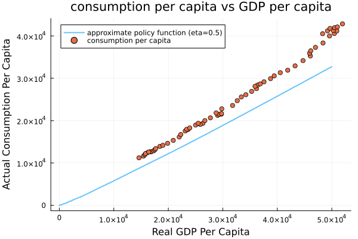
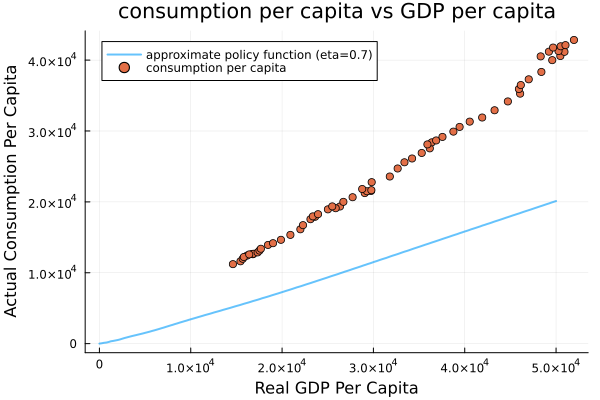
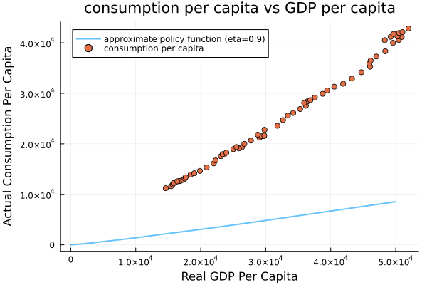

# Optimal Stochastic Growth Model Using U.S. Data (Penn World Table)

## Project Overview

This project implements a discrete-time stochastic optimal growth model using real macroeconomic data from the Penn World Table (PWT). Inspired by the [QuantEcon Julia notebook series](https://julia.quantecon.org/intro.html), especially Optimal Growth I, I decided to reproduce and extend the model with real world data. While studying the QuantEcon Julia notebooks on macroeconomic modeling and decision theory, I wanted to:

- apply the stochastic optimal growth model to real data,
- compare the theoretical optimal policy to observed outcomes, and
- explore how socio-economic parameters influence growth dynamics.

## Dataset — Penn World Table (PWT)

The project uses PWT, which contains national accounts, GDP data, and consumption data.

We restrict attention to:

United States (country code: USA)

years 1950–2015

selected variables: 

| Variable         | Meaning                                |
| ---------------- | -------------------------------------- |
| `RGDPe`, `RGDPo` | Real GDP (expenditure and output side) |
| `CGDPe`, `CGDPo` | Constant price GDP equivalents         |
| `CCON`           | Consumption                  |
| `CDA`            | Domestic absorption                    |
| `CK`             | Capital stock                          |
| `CTFP`, `CWTFP`  | TFP and welfare-relevant TFP           |
| `POP`            | Population size                        |

All values are in millions of 2005 USD.

## Data Cleaning steps:

1. filtered rows to retain only USA
2. removed unused columns
3. checked/removed missing values
4. computed per-capita values

## Exploratory Data Analysis (EDA)

We plotted:
1. GDP vs Year:
  Comparison across measures (CGDPo, CGDPe, RGDPo, RGDPe)

    
    
    
  

2. Policy Function Plot:
  Optimal consumption vs output/capital showing how the policy reacts to state changes. This helped verify economic interpretation before solving the model.

    

## The Economic Model

We implement the stochastic optimal growth model:

### Goal

A planner maximizes social welfare function:$\mathbb{E} \left[ \sum_{t = 0}^{\infty} \beta^t u(c_t) \right]$

subject to $y_{t+1} = f(y_t - c_t) \xi_{t+1}\quad \text{and} \quad0 \leq c_t \leq y_t\quad \text{for all } t$

where
- $k_t$ = capital stock
- $c_t$ = consumption
- $\beta$ = discount factor

We use the utility function: $u(c) = (c^{1-\eta} -1) / (1-\eta)$
- High $\eta$ is more risk averse economy
- For low $\eta$, cosumption fluctuations matter less.

## Computational Method

We use:
- Value Function Iteration using Bellman operator
- Numerical maximization
- Interpolation of value & policy functions

Libraries used include Optim, NLSolve, GLM, Plots, Interpolations, Statistics, etc.

## Results 

We geneate five policy plots for different $\eta$ values.

## Next Steps

- Parameter sensitivity:
simulate how the optimal policy changes when $\alpha$, $\beta$, or shock variance changes.

- Alternative production models

- Cross-country comparison
run same procedure for other countries and compare.
